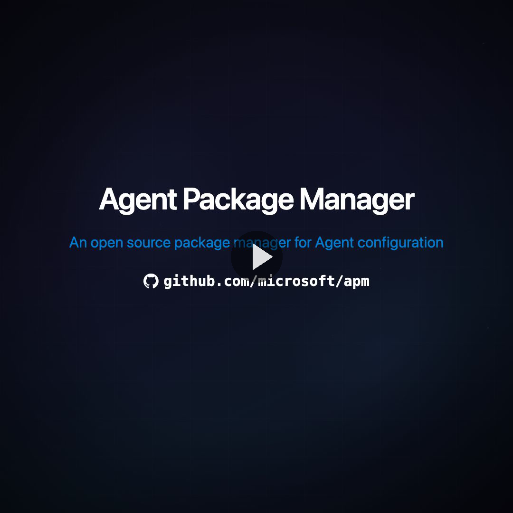

# APM – Agent Package Manager

**An open-source, community-driven dependency manager for AI agents.**

Think `package.json`, `requirements.txt`, or `Cargo.toml` — but for AI agent configuration.

GitHub Copilot · Claude Code · Cursor · OpenCode

**[Documentation](https://microsoft.github.io/apm/)** · **[Quick Start](https://microsoft.github.io/apm/getting-started/quick-start/)** · **[CLI Reference](https://microsoft.github.io/apm/reference/cli-commands/)**

<div align="center">
  <a href="https://github.com/microsoft/apm/releases/download/v0.8.2/apm-showcase.mp4">
    
  </a>
  <br>
  <sub>▶ Watch the 1-minute overview</sub>
</div>

## Why APM

AI coding agents need context to be useful — standards, prompts, skills, plugins — but today every developer sets this up manually. Nothing is portable nor reproducible. There's no manifest for it.

**APM fixes this.** Declare your project's agentic dependencies once in `apm.yml`, and every developer who clones your repo gets a fully configured agent setup in seconds — with transitive dependency resolution, just like npm or pip. It's also the first tool that lets you **author plugins** with a real dependency manager and export standard `plugin.json` packages.

```yaml
# apm.yml — ships with your project
name: your-project
version: 1.0.0
dependencies:
  apm:
    # Skills from any repository
    - anthropics/skills/skills/frontend-design
    # Plugins
    - github/awesome-copilot/plugins/context-engineering
    # Specific agent primitives from any repository
    - github/awesome-copilot/agents/api-architect.agent.md
    # A full APM package with instructions, skills, prompts, hooks...
    - microsoft/apm-sample-package#v1.0.0
```

```bash
git clone <org/repo> && cd <repo>
apm install    # every agent is configured
```

## Highlights

- **[Author plugins with a real supply chain](https://microsoft.github.io/apm/guides/plugins/)** — build Copilot, Claude, and Cursor plugins using transitive dependencies, lockfile pinning, `devDependencies`, and security scanning — then `apm pack --format plugin` to export a standard `plugin.json` that works without APM
- **[One manifest for everything](https://microsoft.github.io/apm/reference/primitive-types/)** — instructions, skills, prompts, agents, hooks, plugins, MCP servers
- **[Install from anywhere](https://microsoft.github.io/apm/guides/dependencies/)** — GitHub, GitLab, Bitbucket, Azure DevOps, GitHub Enterprise, any git host
- **[Transitive dependencies](https://microsoft.github.io/apm/guides/dependencies/)** — packages can depend on packages; APM resolves the full tree
- **[Compile to standards](https://microsoft.github.io/apm/guides/compilation/)** — `apm compile` produces `AGENTS.md` (GitHub Copilot, OpenCode), `CLAUDE.md` (Claude Code), and `.cursor/rules/` (Cursor)
- **[Content security](https://microsoft.github.io/apm/enterprise/security/)** — `apm audit` scans for hidden Unicode characters; `apm install` blocks compromised packages before agents can read them
- **[Pack & distribute](https://microsoft.github.io/apm/guides/pack-distribute/)** — `apm pack` bundles your configuration as a zipped package or a standalone plugin
- **[CI/CD ready](https://github.com/microsoft/apm-action)** — GitHub Action for automated workflows

## Get Started

#### Linux / macOS

```bash
curl -sSL https://aka.ms/apm-unix | sh
```

#### Windows

```powershell
irm https://aka.ms/apm-windows | iex
```

Native release binaries are published for macOS, Linux, and Windows x86_64. `apm update` reuses the matching platform installer.

<details>
<summary>Other install methods</summary>

#### Linux / macOS

```bash
# Homebrew
brew install microsoft/apm/apm
# pip
pip install apm-cli
```

#### Windows

```powershell
# Scoop
scoop bucket add apm https://github.com/microsoft/scoop-apm
scoop install apm
# pip
pip install apm-cli
```

</details>

Then start adding packages:

```bash
apm install microsoft/apm-sample-package#v1.0.0
```

See the **[Getting Started guide](https://microsoft.github.io/apm/getting-started/quick-start/)** for the full walkthrough.

## Community

Created and maintained by [@danielmeppiel](https://github.com/danielmeppiel).

- [Roadmap & Discussions](https://github.com/microsoft/apm/discussions/116)
- [Contributing](CONTRIBUTING.md)
- [AI Native Development guide](https://danielmeppiel.github.io/awesome-ai-native) — a practical learning path for AI-native development

---

**Built on open standards:** [AGENTS.md](https://agents.md) · [Agent Skills](https://agentskills.io) · [MCP](https://modelcontextprotocol.io)

## Trademarks

This project may contain trademarks or logos for projects, products, or services. Authorized use of Microsoft trademarks or logos is subject to and must follow [Microsoft's Trademark & Brand Guidelines](https://www.microsoft.com/en-us/legal/intellectualproperty/trademarks/usage/general). Use of Microsoft trademarks or logos in modified versions of this project must not cause confusion or imply Microsoft sponsorship. Any use of third-party trademarks or logos are subject to those third-party's policies.
