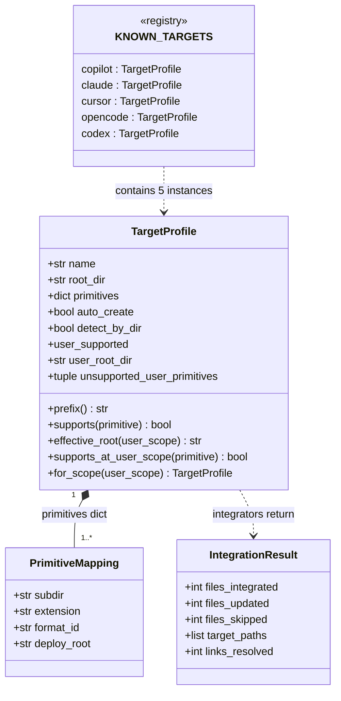
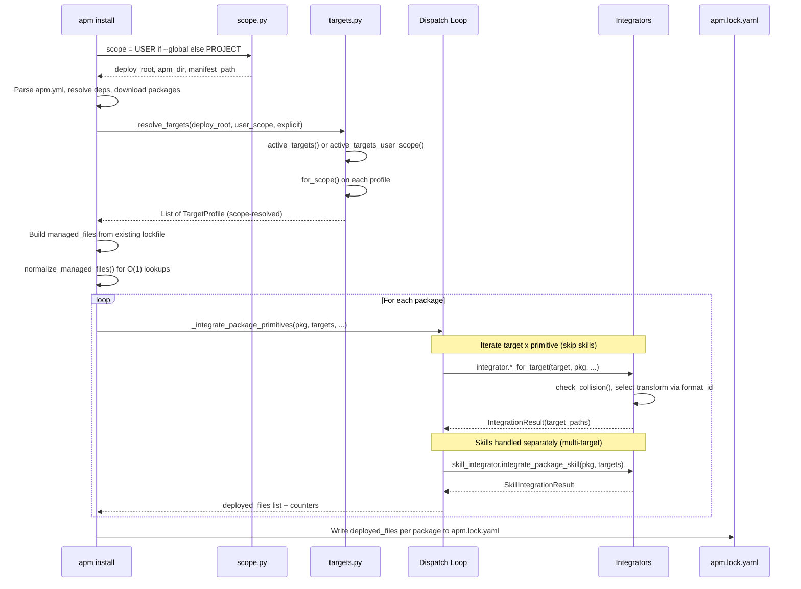
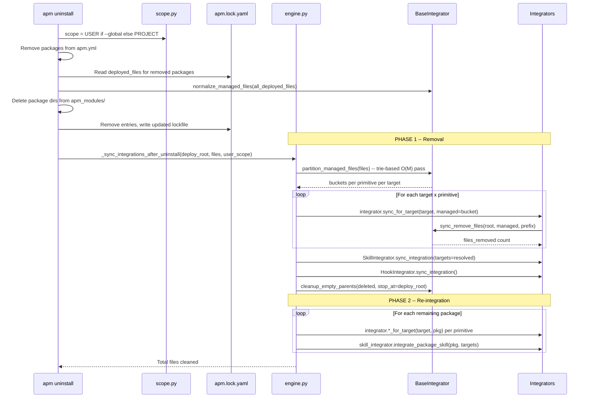
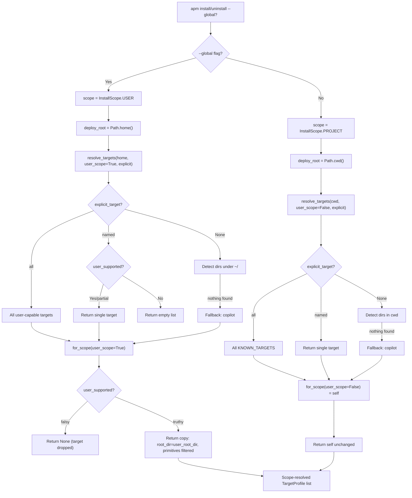
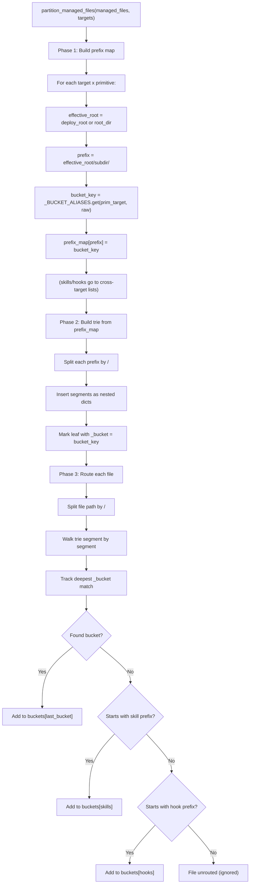
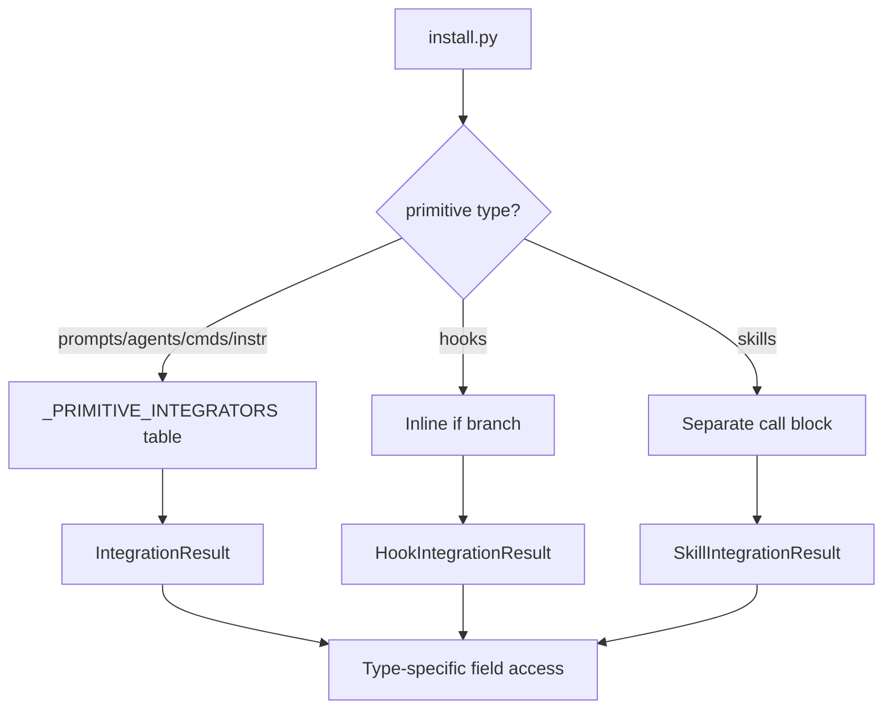
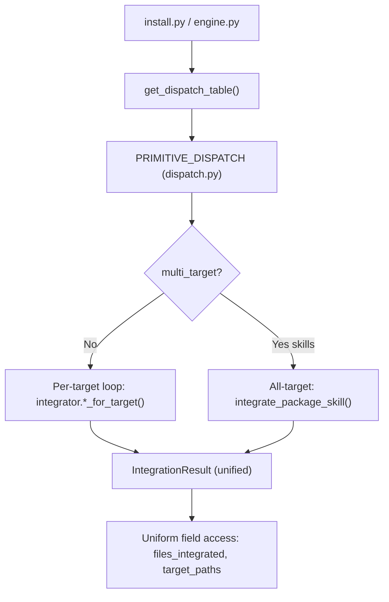

# APM Targeting Architecture

## 1. Executive Summary

APM deploys six AI coding agent primitives -- instructions, agents, commands, prompts, hooks, and skills -- to five supported coding tools (Copilot, Claude, Cursor, OpenCode, Codex). Each tool stores these primitives in different directories, with different file extensions, and sometimes with entirely different file formats. Copilot wants `.instructions.md` under `.github/instructions/`; Cursor wants the same content as `.mdc` under `.cursor/rules/` with a transformed frontmatter block. A naive implementation would require an `if/elif` chain for every combination of primitive and target, and that chain would need to exist in both install and uninstall code paths.

The targeting architecture avoids this by making the entire system **table-driven**. A single registry (`KNOWN_TARGETS`) declares what each target supports and how content should be formatted. `resolve_targets()` combines directory detection, explicit selection, and scope resolution into one call. Integrators receive a scope-resolved `TargetProfile` and use its `PrimitiveMapping` to select the correct content transform, file extension, and deploy path. Adding a sixth tool means adding a registry entry and (if the format is new) a transform function -- no conditional branches in any dispatch loop.

**Source files**: `targets.py` (registry + resolution), `base_integrator.py` (shared infrastructure), `install.py` (install dispatch), `uninstall/engine.py` (uninstall dispatch), `scope.py` (project vs. user paths).

---

## 2. Static Data Model

The data model is intentionally flat: two frozen dataclasses and a dict-based registry. There are no abstract base classes, no inheritance hierarchies among targets, and no generics. This flatness is a deliberate tradeoff -- it keeps the mental model simple and makes the system easy to extend by adding rows to a table rather than subclasses to a tree.

*Figure 1: The core data model. `TargetProfile` owns a dict of `PrimitiveMapping` entries; `KNOWN_TARGETS` holds five instances; integrators produce `IntegrationResult`.*



### Key relationships

- **TargetProfile** owns a `primitives` dict keyed by primitive name (`"instructions"`, `"agents"`, etc.) whose values are `PrimitiveMapping` instances. A target only deploys the primitives listed in this dict -- missing entries mean "this target does not support that primitive."
- **`for_scope(user_scope=True)`** returns a frozen copy with `root_dir` swapped to `user_root_dir` and `primitives` filtered to exclude `unsupported_user_primitives`. Returns `None` when `user_supported` is falsy -- which means the target is dropped entirely for user-scope installs.
- **`resolve_targets()`** is the single entry point: it detects active targets, applies `for_scope()`, and returns scope-resolved profiles ready for integrators. Downstream code never calls `active_targets()` or `for_scope()` directly.

### Why frozen dataclasses?

`PrimitiveMapping` and `TargetProfile` are `@dataclass(frozen=True)`. Freezing prevents accidental mutation during the dispatch loop -- if an integrator could modify a `TargetProfile` mid-install, subsequent targets would see corrupted state. The `for_scope()` method uses `dataclasses.replace()` to create a new instance rather than mutating in place, so the original `KNOWN_TARGETS` entries are never altered.

---

## 3. Target Registry

The registry is the single source of truth for what APM can deploy and where. It exists because each coding tool has made independent design decisions about directory layout, file naming, and format conventions. Rather than scattering that knowledge across integrator code, it is centralized in one dict so that a contributor can read `KNOWN_TARGETS` and immediately see the full deployment surface area.

### Why primitives are per-target rather than global

An early design considered a global primitive registry: define "instructions" once, then let each target declare compatibility. This was rejected for three reasons. First, the same primitive concept maps to different physical representations across targets -- Copilot calls them "instructions" in an `instructions/` dir with `.instructions.md` extension, while Cursor calls them "rules" in a `rules/` dir with `.mdc` extension and a transformed frontmatter. A global definition would need per-target overrides for every field, which is just a per-target mapping with extra indirection. Second, some targets support primitives that others do not (only Copilot has prompts; only Claude and OpenCode have commands), so a global registry would be full of "not supported" markers. Third, the per-target approach means `target.primitives.items()` gives you exactly the set of primitives to deploy -- no filtering step, no "is this primitive supported?" check. The dispatch loop iterates what exists and skips nothing. This keeps the inner loop trivially correct: if it appears in the dict, it gets deployed.

### Primitive support matrix

| Primitive | Copilot | Claude | Cursor | OpenCode | Codex |
|-----------|---------|--------|--------|----------|-------|
| instructions | Y | Y | Y | - | - |
| agents | Y | Y | Y | Y | Y |
| commands | - | Y | - | Y | - |
| prompts | Y | - | - | - | - |
| hooks | Y | Y | Y | - | Y |
| skills | Y | Y | Y | Y | Y |

### Per-target primitive details

| Target | Primitive | format_id | extension | subdir | deploy_root | user_scope |
|--------|-----------|-----------|-----------|--------|-------------|------------|
| **copilot** | instructions | `github_instructions` | `.instructions.md` | `instructions` | - | blocked |
| | prompts | `github_prompt` | `.prompt.md` | `prompts` | - | blocked |
| | agents | `github_agent` | `.agent.md` | `agents` | - | partial |
| | skills | `skill_standard` | `/SKILL.md` | `skills` | - | partial |
| | hooks | `github_hooks` | `.json` | `hooks` | - | partial |
| **claude** | instructions | `claude_rules` | `.md` | `rules` | - | full |
| | agents | `claude_agent` | `.md` | `agents` | - | full |
| | commands | `claude_command` | `.md` | `commands` | - | full |
| | skills | `skill_standard` | `/SKILL.md` | `skills` | - | full |
| | hooks | `claude_hooks` | `.json` | `hooks` | - | full |
| **cursor** | instructions | `cursor_rules` | `.mdc` | `rules` | - | blocked |
| | agents | `cursor_agent` | `.md` | `agents` | - | partial |
| | skills | `skill_standard` | `/SKILL.md` | `skills` | - | partial |
| | hooks | `cursor_hooks` | `.json` | `hooks` | - | partial |
| **opencode** | agents | `opencode_agent` | `.md` | `agents` | - | partial |
| | commands | `opencode_command` | `.md` | `commands` | - | partial |
| | skills | `skill_standard` | `/SKILL.md` | `skills` | - | partial |
| **codex** | agents | `codex_agent` | `.toml` | `agents` | - | none |
| | skills | `skill_standard` | `/SKILL.md` | `skills` | `.agents` | none |
| | hooks | `codex_hooks` | `hooks.json` | _(empty)_ | - | none |

### Scope resolution summary

| Target | root_dir | user_root_dir | user_supported | Primitives blocked at user scope |
|--------|----------|---------------|----------------|----------------------------------|
| copilot | `.github` | `.copilot` | partial | prompts, instructions |
| claude | `.claude` | `.claude` | full | _(none)_ |
| cursor | `.cursor` | `.cursor` | partial | instructions |
| opencode | `.opencode` | `.config/opencode` | partial | hooks |
| codex | `.codex` | _(n/a)_ | none | _(all)_ |

---

## 4. Install Flow

The install path is where packages become deployed files. The key design decision here is that the dispatch loop is driven entirely by the `target.primitives` dict rather than by a hardcoded list of primitive names. This means the loop automatically skips primitives that a target does not support, and a new target's primitives are deployed without any changes to the dispatch code.

*Figure 2: The install sequence from CLI invocation through target resolution, per-package dispatch, and lockfile persistence.*



### Dispatch table

The `_PRIMITIVE_INTEGRATORS` dict maps each primitive to its integrator and method. The dispatch loop iterates `target.primitives.items()`, looks up each primitive name in this table, and calls the method via `getattr()`. This means the loop body is a single generic code path rather than five specialized branches.

| Key | Integrator | Method |
|-----|------------|--------|
| `prompts` | PromptIntegrator | `integrate_prompts_for_target()` |
| `agents` | AgentIntegrator | `integrate_agents_for_target()` |
| `commands` | CommandIntegrator | `integrate_commands_for_target()` |
| `instructions` | InstructionIntegrator | `integrate_instructions_for_target()` |
| `hooks` | HookIntegrator | `integrate_hooks_for_target()` |
| `skills` | SkillIntegrator | `integrate_package_skill()` (multi-target) |

### Why skills and hooks are special

Skills receive _all_ targets at once because `SkillIntegrator` deploys the same directory to every active target that supports `"skills"`. Routing internally avoids duplicate discovery and allows Codex's `deploy_root` override (`.agents/` instead of the target's `root_dir`) to be handled in one place.

Hooks dispatch per-target in the loop but return a `HookIntegrationResult` (with `hooks_integrated`) instead of `IntegrationResult` (with `files_integrated`). The different return type reflects a real semantic difference: hooks may merge into a shared JSON file (e.g., `.claude/settings.json`) rather than deploying individual files. They are handled in a separate `if` branch within the loop rather than through the dispatch table.

---

## 5. Uninstall Flow

Uninstall is the harder problem. Install can be purely additive, but uninstall must remove exactly the right files, handle shared resources (two packages contributing hooks to the same JSON file), and leave the workspace in a consistent state. The two-phase approach (remove everything, then re-integrate survivors) is simpler and more reliable than the alternative of tracking per-file ownership at sub-file granularity.

*Figure 3: The two-phase uninstall -- partition and remove in Phase 1, re-integrate remaining packages in Phase 2.*



### Why two phases?

Phase 1 removes **all** files owned by the uninstalled packages. Phase 2 re-deploys from remaining packages to fill any gaps. Consider the scenario where two packages both contribute hooks to `.claude/settings.json`. Removing one package's hooks requires regenerating the merged file from the remaining package. Tracking which lines in a merged JSON file belong to which package would be fragile and error-prone. Instead, the two-phase approach wipes the merged file in Phase 1 and rebuilds it from scratch in Phase 2 -- a classic "rebuild from source" strategy that trades a small amount of redundant work for guaranteed correctness.

The engine uses two separate dispatch tables (`_SYNC_DISPATCH` for removal, `_REINT_DISPATCH` for re-integration) that mirror the install-side `_PRIMITIVE_INTEGRATORS`. Skills and hooks are handled outside these tables for the same reasons described in Section 4.

---

## 6. Scope Resolution

APM supports two deployment scopes: project (deploy to the current repo) and user (deploy to `~/` for tool-wide configuration). The challenge is that each tool stores user-level configuration in a different directory -- Copilot uses `~/.copilot/`, OpenCode uses `~/.config/opencode/` -- and some primitives that work at project scope do not exist at user scope (Copilot has no user-level prompts). Scope resolution centralizes this complexity in `TargetProfile.for_scope()` so that all downstream code -- integrators, partition routing, sync -- sees a profile that already reflects the correct paths and available primitives.

*Figure 4: Scope resolution flowchart showing how `--global` flag, target detection, and `for_scope()` combine to produce the final target list.*



### Path resolution table

`scope.py` provides four functions that resolve paths based on `InstallScope`. The split between `deploy_root` (where files land) and `apm_dir` (where metadata lives) is intentional -- at user scope, deployed files go directly under `~/` (e.g., `~/.claude/agents/`) but metadata goes under `~/.apm/` so it does not pollute the home directory.

| Function | PROJECT | USER |
|----------|---------|------|
| `get_deploy_root()` | `Path.cwd()` | `Path.home()` |
| `get_apm_dir()` | `Path.cwd()` | `~/.apm/` |
| `get_modules_dir()` | `<cwd>/apm_modules/` | `~/.apm/apm_modules/` |
| `get_manifest_path()` | `<cwd>/apm.yml` | `~/.apm/apm.yml` |

---

## 7. Partition Routing

During uninstall (and collision detection during install), APM needs to route each managed file path to the correct integrator bucket. The challenge is that file paths come from `apm.lock.yaml` as flat strings like `.github/prompts/helper.prompt.md`, and the system must determine that this belongs to the "prompts" bucket for the Copilot target. With five targets and six primitives, the naive approach of checking each path against every possible prefix would be O(N * P) where P is the number of prefixes. The trie-based router reduces this to O(depth) per path -- typically 2-3 segments.

*Figure 5: The three-phase partition process -- build a prefix map from targets, construct a trie, then route each file path in a single pass.*



### Why a trie?

A simple `str.startswith()` check against a list of prefixes breaks for multi-level roots like `.config/opencode/`. The prefix `.config/` would also match `.config/something-else/`, leading to false routing. The trie walks segments one at a time and only matches when every segment in the prefix matches. It also naturally handles the longest-prefix-match requirement: `.github/hooks/scripts/` is a longer match than `.github/hooks/` and correctly routes script files to the hooks bucket.

### Trie example

Given the managed file `.github/prompts/helper.prompt.md`:

```
Trie:
  ".github" ->
    "prompts" -> {_bucket: "prompts"}
    "agents"  -> {_bucket: "agents_github"}
    "instructions" -> {_bucket: "instructions"}
    ...

Walk: ".github" -> found node
      "prompts" -> found node, _bucket = "prompts"
      "helper.prompt.md" -> no child, stop

Result: buckets["prompts"].add(".github/prompts/helper.prompt.md")
```

### Bucket alias mapping

Bucket aliases exist because the install side and the uninstall side were developed at different times, and some callers use well-known bucket names (e.g., `"prompts"`) while the auto-generated key would be `"prompts_copilot"`. The alias map bridges this gap and is shared between `partition_managed_files()` and `partition_bucket_key()` so the mapping is defined exactly once.

| Raw key | Canonical bucket |
|---------|-----------------|
| `prompts_copilot` | `prompts` |
| `agents_copilot` | `agents_github` |
| `commands_claude` | `commands` |
| `commands_opencode` | `commands_opencode` |
| `instructions_copilot` | `instructions` |
| `instructions_cursor` | `rules_cursor` |
| `instructions_claude` | `rules_claude` |

---

## 8. Content Transforms

Each primitive type may require a different file format for each target. The `format_id` field in `PrimitiveMapping` is the switch point -- integrators use it to select the correct transform function. Most agents are verbatim markdown copies with link resolution; instructions require frontmatter transformation; hooks require merge strategies that vary by target. The transform is always selected inside the integrator's `integrate_*_for_target()` method, keeping the dispatch loop format-agnostic.

### Instructions

Instructions are the most divergent primitive. The same source file (an `.instructions.md` with optional YAML frontmatter including `applyTo:` patterns) produces three different outputs depending on the target.

| Target | format_id | Transform |
|--------|-----------|-----------|
| Copilot | `github_instructions` | **Verbatim** -- copy `.instructions.md` as-is |
| Cursor | `cursor_rules` | Parse YAML frontmatter; `applyTo: "pattern"` becomes `globs: "pattern"`; auto-generate `description` if missing; output `.mdc` |
| Claude | `claude_rules` | Parse YAML frontmatter; `applyTo: "pattern"` becomes `paths: ["pattern"]` YAML list; no `applyTo` = unconditional rule (no frontmatter); output `.md` |

### Agents

| Target | format_id | Transform |
|--------|-----------|-----------|
| Copilot | `github_agent` | **Verbatim** MD with link resolution |
| Claude | `claude_agent` | **Verbatim** MD with link resolution |
| Cursor | `cursor_agent` | **Verbatim** MD with link resolution |
| OpenCode | `opencode_agent` | **Verbatim** MD with link resolution |
| Codex | `codex_agent` | **YAML-to-TOML**: extract `name`/`description` from YAML frontmatter; markdown body becomes `developer_instructions` TOML field; output `.toml` |

### Commands

| Target | format_id | Transform |
|--------|-----------|-----------|
| Claude | `claude_command` | Parse frontmatter; normalize keys (`allowedTools` to `allowed-tools`, `argumentHint` to `argument-hint`); rewrite frontmatter; output `.md` |
| OpenCode | `opencode_command` | Same as Claude |

### Prompts

| Target | format_id | Transform |
|--------|-----------|-----------|
| Copilot | `github_prompt` | **Verbatim** copy with link resolution |

### Hooks

Hooks are the most complex primitive because they deploy differently across targets. Copilot uses individual JSON files per hook; Claude, Cursor, and Codex merge hooks into a shared settings file. All hook integrators rewrite script paths (`command`, `bash`, `powershell`) to be target-relative (e.g., `./.github/hooks/pkg/script.sh`).

| Target | format_id | Deploy pattern | Merge strategy |
|--------|-----------|---------------|----------------|
| Copilot | `github_hooks` | Individual `.json` files + script dirs | Per-file (no merge) |
| Claude | `claude_hooks` | Merge into `.claude/settings.json` | Additive merge; `_apm_source` markers for cleanup |
| Cursor | `cursor_hooks` | Merge into `.cursor/hooks.json` | Additive merge; `_apm_source` markers for cleanup |
| Codex | `codex_hooks` | Merge into `.codex/hooks.json` | Additive merge; `_apm_source` markers for cleanup |

### Skills

| Target | format_id | Transform |
|--------|-----------|-----------|
| All 5 | `skill_standard` | **Directory copy** -- entire skill directory (excluding `.apm/`) copied to `{effective_root}/skills/{skill_name}/` |

Skills are always `skill_standard` format and deploy identically across all targets. The only per-target difference is the deploy path (Codex uses `.agents/skills/` via `deploy_root` override).

---

## 9. Consistency Guarantees

The targeting architecture maintains several invariants across commands, scopes, and targets. Each guarantee exists to prevent a specific class of bug. This section explains what would go wrong without each one.

### Across commands (install / uninstall)

1. **Same target resolution**: Both `install` and `uninstall` call `resolve_targets()` with identical parameters derived from `scope` and `apm.yml`'s `target:` field. The resolved target list drives both integration and cleanup. **Without this**: If install resolved `[copilot, claude]` but uninstall resolved `[copilot]`, Claude files would be orphaned on disk with no way to remove them short of manual deletion. The lockfile would show files that no command knows how to clean up.

2. **Manifest-based tracking**: Install records every deployed file path (forward-slash, `.as_posix()`) in `apm.lock.yaml` per package. Uninstall reads these exact paths for removal -- no glob-based guessing. **Without this**: Glob-based removal (e.g., delete `*.prompt.md` from `.github/prompts/`) would delete user-authored files that happen to match the pattern. The manifest approach means APM only touches files it created.

3. **Partition symmetry**: `partition_managed_files()` uses the same trie and alias mapping for both install (collision detection) and uninstall (removal routing). The `partition_bucket_key()` function ensures callers query the same canonical bucket names. **Without this**: If install used the raw key `"prompts_copilot"` but uninstall queried for bucket `"prompts"`, the managed-files lookup would return an empty set and every prompt would be treated as a collision (skipped) or missed during cleanup (orphaned).

4. **Two-phase uninstall**: Phase 1 removes all files from uninstalled packages; Phase 2 re-integrates from remaining packages. This handles shared-file scenarios (e.g., merged hook JSON) without per-file ownership tracking. **Without this**: Removing a package that contributed hooks to `.claude/settings.json` would either leave stale hook entries (if you only remove the package's individual files) or delete hooks from other packages (if you wipe the merged file). The two-phase approach guarantees the merged file reflects exactly the remaining packages.

### Across scopes (project / user)

1. **Single transformation point**: `TargetProfile.for_scope()` is the only place where scope changes a profile. It adjusts `root_dir` and filters `primitives` -- all downstream code works with the already-resolved profile. **Without this**: If integrators had to check `user_scope` themselves, each one would need its own scope logic, leading to inconsistent handling. One integrator might forget to filter `unsupported_user_primitives`, deploying instructions to `~/.copilot/instructions/` where Copilot CLI would never read them.

2. **Path isolation**: `get_deploy_root()` returns `Path.cwd()` or `Path.home()`, and all integrators compose paths relative to this root. Metadata (`apm.yml`, `apm.lock.yaml`, `apm_modules/`) lives under `get_apm_dir()` which is `cwd` or `~/.apm/` respectively. **Without this**: If user-scope metadata lived at `~/.apm.yml` (next to deployed files), it would be visible to every tool. If it lived at `~/.claude/apm.yml`, it would be target-specific and break multi-target user installs.

3. **Unsupported primitive warnings**: `warn_unsupported_user_scope()` reports which primitives are unavailable at user scope before installation begins. Primitives are silently excluded from the resolved profile so integrators never see them. **Without this**: Users would get no feedback when their package's prompts are silently dropped during `--global` install. Or worse, integrators would attempt to deploy them and either fail with an error or create files in a location the tool ignores.

### Across targets (all 5)

1. **Data-driven dispatch**: The `_PRIMITIVE_INTEGRATORS` table and the `target.primitives` dict together determine what runs. Adding a new target or primitive requires only a registry entry -- no conditional branches in the dispatch loop. **Without this**: Every new target would require touching the dispatch loop in both `install.py` and `uninstall/engine.py`, plus the partition router, plus the collision detector. Missing any one of these sites would cause silent data loss or orphaned files.

2. **BaseIntegrator contract**: All integrators extend `BaseIntegrator` and use its `check_collision()`, `sync_remove_files()`, `validate_deploy_path()`, and `cleanup_empty_parents()` methods. Security validation (path traversal, prefix whitelisting, symlink resolution) is applied uniformly. **Without this**: A new integrator that implements its own collision detection might skip the `managed_files` check and overwrite user-authored files. A custom `sync_remove_files()` might not validate paths and become a vehicle for path traversal attacks via crafted lockfile entries.

3. **Format-driven transforms**: Each `PrimitiveMapping.format_id` selects the content transform inside the integrator. The integrator method signature is identical across targets (`integrate_*_for_target(target, pkg_info, project_root, ...)`), and the `format_id` is the only switch point. **Without this**: Integrators would need to check `target.name` to decide how to transform content, coupling the integrator to specific target names. Adding a new target that uses the same format as an existing one would require duplicating the transform logic.

4. **Cross-target primitives**: Skills and hooks handle multi-target deployment internally. Skills deploy to every active target that supports them. Hooks merge into target-specific JSON files with `_apm_source` markers for clean removal. **Without this**: If skills were dispatched per-target like agents, the skill directory would be discovered and copied N times (once per target), wasting I/O. If hooks did not use `_apm_source` markers, uninstalling a package would require diffing the merged JSON against all remaining packages to determine which entries to remove.

---

## Post-Refactor: Unified Dispatch Architecture

> This section documents the changes introduced in PR #562
> (refactor/integration-dispatch-architecture).
> It describes the before/after of the dispatch system and how it works now.

### Before: Scattered Dispatch with Multiple Result Types

Prior to this refactor the mapping from primitive names to integrator methods
lived in three separate places:

1. `_PRIMITIVE_INTEGRATORS` in `install.py` -- a dict of
   `(integrator, method_name, counter_key)` tuples covering prompts, agents,
   commands, and instructions.
2. `_SYNC_DISPATCH` and `_REINT_DISPATCH` in `uninstall/engine.py` -- two more
   dicts that duplicated the primitive-to-integrator mapping for the removal and
   re-integration phases.
3. Hooks were excluded from all three tables and handled via inline
   `if target.name == "claude" / "cursor" / "codex"` branches with
   near-identical logic copy-pasted three times.

Each integrator family also returned its own result dataclass
(`IntegrationResult`, `HookIntegrationResult`, `SkillIntegrationResult`),
forcing callers to use type-specific field names (`hooks_integrated` vs.
`files_integrated` vs. `skill_created`) even though the information they
extracted was the same: a count and a list of deployed paths.



### After: One Dispatch Table, One Result Type

The refactor introduces a single `PRIMITIVE_DISPATCH` table in the new
`src/apm_cli/integration/dispatch.py` module. Every primitive -- including
hooks -- has exactly one entry. The table is defined as a dict of
`PrimitiveDispatch` dataclasses:

```python
@dataclass(frozen=True)
class PrimitiveDispatch:
    integrator_class: Type[BaseIntegrator]
    integrate_method: str      # install method name
    sync_method: str           # uninstall method name
    counter_key: str           # result counter key
    multi_target: bool = False # True = receives all targets at once
```

`get_dispatch_table()` returns the table lazily (imports are deferred to avoid
circular dependencies at module-load time). Both `install.py` and
`uninstall/engine.py` now import `get_dispatch_table()` and iterate the same
data structure. All integrators return the unified `IntegrationResult`, which
carries `files_integrated`, `target_paths`, and optional fields that default to
zero for integrators that do not use them (`scripts_copied`,
`sub_skills_promoted`, `skill_created`).



### Hook Deduplication via `_MERGE_HOOK_TARGETS`

Claude, Cursor, and Codex all merge hook entries into a single JSON config file
(e.g., `.claude/settings.json`, `.cursor/hooks.json`). Before the refactor,
each had a dedicated method with nearly identical logic. Now
`HookIntegrator._integrate_merged_hooks()` is the shared implementation, and
the per-target differences are captured in a `_MERGE_HOOK_TARGETS` config dict:

```python
_MERGE_HOOK_TARGETS: dict[str, _MergeHookConfig] = {
    "claude": _MergeHookConfig("settings.json", "claude",  require_dir=False),
    "cursor": _MergeHookConfig("hooks.json",    "cursor",  require_dir=True),
    "codex":  _MergeHookConfig("hooks.json",    "codex",   require_dir=True),
}
```

To add a new merge-target hook (e.g., Windsurf), add one entry to
`_MERGE_HOOK_TARGETS` with the config filename, target key, and whether the
target directory must pre-exist -- no other code changes required.

### Coverage Assertion

`check_primitive_coverage()` (in `coverage.py`) compares the primitives
registered in `KNOWN_TARGETS` against the keys in the dispatch table. It runs
automatically at test-session start via a `conftest.py` fixture, so any
mismatch -- a new primitive added to `targets.py` without a dispatch entry --
fails the test suite immediately.

### `apm deps update` Coverage

`apm deps update` delegates to `_install_apm_dependencies(update_refs=True)`,
which calls the same dispatch-driven integration loop used by `apm install`.
This means every improvement to the dispatch table (new primitives, bug fixes,
performance changes) applies to dependency updates automatically with zero
additional wiring.

---


## 11. How to Add a New Target

This walkthrough covers adding a hypothetical sixth tool called "Windsurf" that stores its configuration in `.windsurf/`. The steps are ordered by dependency -- each step builds on the previous one.

### Step 1: Define the TargetProfile in `targets.py`

Add an entry to `KNOWN_TARGETS`. Decide which primitives Windsurf supports, what subdirectory and extension each uses, and what `format_id` to assign. If Windsurf uses the same format as an existing target (e.g., verbatim markdown agents like Claude), reuse that `format_id`.

```python
"windsurf": TargetProfile(
    name="windsurf",
    root_dir=".windsurf",
    primitives={
        "instructions": PrimitiveMapping(
            "rules", ".md", "windsurf_rules"
        ),
        "agents": PrimitiveMapping(
            "agents", ".md", "windsurf_agent"  # or "claude_agent" if identical
        ),
        "skills": PrimitiveMapping(
            "skills", "/SKILL.md", "skill_standard"
        ),
        "hooks": PrimitiveMapping(
            "hooks", ".json", "windsurf_hooks"
        ),
    },
    auto_create=False,
    detect_by_dir=True,
    user_supported="partial",        # or True / False
    user_root_dir=".windsurf",       # or ".config/windsurf" etc.
    unsupported_user_primitives=(),  # tuple of blocked primitives
),
```

Key decisions:

- **`auto_create`**: Set to `False` unless you want APM to create `.windsurf/` in greenfield projects. Only `copilot` uses `True` today.
- **`detect_by_dir`**: Set to `True` so APM only deploys to Windsurf when `.windsurf/` already exists. This prevents creating tool directories in repos that don't use the tool.
- **`format_id`**: If the format is identical to an existing target, reuse its `format_id` (e.g., `"claude_agent"` for verbatim MD). Only create a new ID if you need a new transform.

### Step 2: Add format handling in integrators (only if new format_id)

If you introduced a new `format_id` (e.g., `"windsurf_rules"`), add a branch in the corresponding integrator's `integrate_*_for_target()` method to handle it. If you reused an existing `format_id`, skip this step.

For example, in `InstructionIntegrator.integrate_instructions_for_target()`:

```python
elif mapping.format_id == "windsurf_rules":
    content = self._transform_to_windsurf_format(raw_content)
```

### Step 3: Add hook support (only if Windsurf has hooks)

If Windsurf hooks merge into a shared JSON file (like Claude/Cursor/Codex), add
one entry to `_MERGE_HOOK_TARGETS` in `hook_integrator.py`:

```python
"windsurf": _MergeHookConfig(
    config_filename="hooks.json",
    target_key="windsurf",
    require_dir=True,
),
```

The shared `_integrate_merged_hooks()` method handles discovery, merging,
`_apm_source` tagging, and script copying automatically. No other hook code
changes are required.

If Windsurf hooks use individual files (like Copilot), the existing per-file
logic in `integrate_hooks_for_target()` handles them without changes.

### Step 4: Add bucket aliases (only if needed)

If existing callers reference Windsurf buckets by a well-known name that differs from the auto-generated key, add an entry to `_BUCKET_ALIASES` in `base_integrator.py`:

```python
"instructions_windsurf": "rules_windsurf",
```

Most new targets will not need aliases -- they are a backward-compatibility mechanism.

### Step 5: Export (no change needed)

The `__init__.py` exports are for integrator classes and target-system types. Since adding a target only adds a dict entry in `KNOWN_TARGETS`, no export changes are required. The `get_integration_prefixes()` function automatically includes the new target's prefix.

### Step 6: Test

- Create a test project with a `.windsurf/` directory.
- Run `apm install` and verify files land in the correct locations.
- Run `apm uninstall` and verify files are cleanly removed.
- Test `--target windsurf` explicit selection.
- Test `--global` if `user_supported` is not `False`.

### What you do NOT need to change

- The unified dispatch table in `dispatch.py` (`PRIMITIVE_DISPATCH`) -- it dispatches by primitive name, not target name, so new targets are invisible to it.
- The dispatch loop in `install.py` -- it iterates `target.primitives` and looks up each primitive in the dispatch table automatically.
- The uninstall engine in `engine.py` -- it uses the same dispatch table via `get_dispatch_table()`.
- The partition router (`partition_managed_files`) -- it builds its trie from `KNOWN_TARGETS` dynamically.
- The scope resolver (`resolve_targets`) -- it iterates `KNOWN_TARGETS.values()`.
- The path security validator (`validate_deploy_path`) -- it derives allowed prefixes from `get_integration_prefixes()`.
- The coverage assertion (`check_primitive_coverage`) -- it validates primitives vs. dispatch entries, not targets.

This is the payoff of the table-driven design: a new target is a data change, not a code change (unless the target introduces a new file format).

---

## 12. How to Add a New Primitive

Adding a new primitive type (e.g., "workflows") is a larger change than adding a new target because it requires a new integrator class and wiring in both the install and uninstall dispatch paths. Here is the step-by-step process.

### Step 1: Add PrimitiveMapping entries to relevant targets in `targets.py`

For each target that supports the new primitive, add an entry to its `primitives` dict:

```python
# In the copilot TargetProfile:
"workflows": PrimitiveMapping(
    "workflows", ".workflow.md", "github_workflow"
),

# In the claude TargetProfile:
"workflows": PrimitiveMapping(
    "workflows", ".md", "claude_workflow"
),
```

Not every target needs to support the new primitive. Only add entries where the tool actually reads the file type.

### Step 2: Create a new integrator class

Create `src/apm_cli/integration/workflow_integrator.py` extending `BaseIntegrator`:

```python
from apm_cli.integration.base_integrator import BaseIntegrator, IntegrationResult

class WorkflowIntegrator(BaseIntegrator):

    def integrate_workflows_for_target(
        self, target, package_info, project_root,
        force=False, managed_files=None, diagnostics=None,
    ) -> IntegrationResult:
        """Deploy workflow files for a single target."""
        mapping = target.primitives.get("workflows")
        if not mapping:
            return IntegrationResult(0, 0, 0, [])
        # Use mapping.format_id to select transform
        # Use self.check_collision() for collision detection
        # Use self.resolve_links() for link resolution
        ...

    def sync_for_target(self, target, apm_package, project_root,
                        managed_files=None):
        """Remove workflow files during uninstall Phase 1."""
        mapping = target.primitives.get("workflows")
        if not mapping:
            return {"files_removed": 0, "errors": 0}
        effective_root = mapping.deploy_root or target.root_dir
        prefix = f"{effective_root}/{mapping.subdir}/"
        return self.sync_remove_files(
            project_root, managed_files, prefix,
        )
```

Follow the `BaseIntegrator` contract: use `check_collision()`, `validate_deploy_path()`, `sync_remove_files()`. Do not reimplement these.

### Step 3: Export from `__init__.py`

Add the import and `__all__` entry:

```python
from .workflow_integrator import WorkflowIntegrator
# Add 'WorkflowIntegrator' to __all__
```

### Step 4: Register in the unified dispatch table (`dispatch.py`)

Add one entry to `_build_dispatch()` in `src/apm_cli/integration/dispatch.py`:

```python
"workflows": PrimitiveDispatch(
    integrator_class=WorkflowIntegrator,
    integrate_method="integrate_workflows_for_target",
    sync_method="sync_for_target",
    counter_key="workflows",
),
```

This single entry wires the new primitive into both the install loop
(`install.py`) and the uninstall engine (`engine.py`) automatically -- no
changes to either file are required. The `check_primitive_coverage()` fixture
will fail until this entry is added, so you cannot forget it.

### Step 5: Add bucket aliases (if needed)

If the auto-generated bucket key (e.g., `"workflows_copilot"`) should map to a simpler name, add it to `_BUCKET_ALIASES` in `base_integrator.py`.

### Step 6: Handle user-scope exclusions

If the new primitive should be blocked at user scope for certain targets, add it to those targets' `unsupported_user_primitives` tuple in `targets.py`.

### What makes this harder than adding a target

Adding a primitive is a larger change than adding a target because it requires a new integrator class. However, the unified dispatch table in `dispatch.py` means you only wire the primitive once (one `PrimitiveDispatch` entry) instead of updating three separate dicts across `install.py` and `engine.py`. The `check_primitive_coverage()` test fixture catches any omission at test time.
